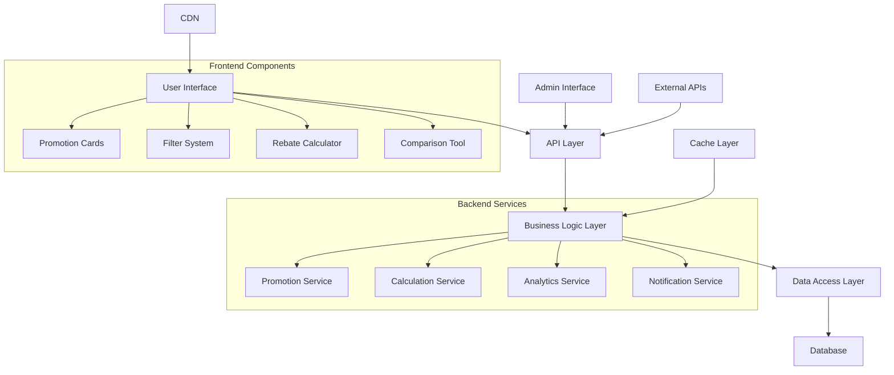

# Design Document

## Overview

The Broker Promotions Enhancement system provides a comprehensive platform for displaying, managing, and interacting with various broker promotional offers including cashback programs, deposit bonuses, commission discounts, and other trading incentives. The system is designed to be scalable, maintainable, and conversion-focused while providing excellent user experience across all devices.

## Architecture

### System Architecture



### Technology Stack

- **Frontend**: Next.js 14, React 18, TypeScript, Tailwind CSS
- **Backend**: Next.js API Routes, Prisma ORM
- **Database**: PostgreSQL with Redis caching
- **Authentication**: NextAuth.js for admin access
- **File Storage**: AWS S3 for broker logos and images
- **Analytics**: Custom tracking with Google Analytics integration

## Components and Interfaces

### Core Components

#### 1. PromotionCard Component

```typescript
interface PromotionCardProps {
  promotion: Promotion;
  variant: 'compact' | 'detailed' | 'comparison';
  showBrokerInfo?: boolean;
  onSelect?: (promotion: Promotion) => void;
}

interface Promotion {
  id: string;
  brokerId: string;
  broker: {
    name: string;
    logo: string;
    rating: number;
    platforms: string[];
  };
  title: string;
  description: string;
  promotionType: PromotionType;
  isActive: boolean;
  isFeatured: boolean;
  startDate: Date;
  endDate?: Date;
  activationMethod: 'automatic' | 'manual' | 'contact_required';
  contactInfo?: ContactInfo;
  requirements: PromotionRequirements;
  rates: PromotionRate[];
  features: PromotionFeature[];
}
```

#### 2. PromotionFilter Component

```typescript
interface FilterState {
  brokers: string[];
  promotionTypes: PromotionType[];
  rebateRange: {
    min: number;
    max: number;
  };
  accountTypes: string[];
  activationMethod: string[];
  sortBy: 'rating' | 'rebate_amount' | 'popularity' | 'newest';
  sortOrder: 'asc' | 'desc';
}

interface PromotionFilterProps {
  filters: FilterState;
  onFiltersChange: (filters: FilterState) => void;
  availableOptions: FilterOptions;
}
```

#### 3. RebateCalculator Component

```typescript
interface CalculatorState {
  brokerId: string;
  promotionId: string;
  monthlyVolume: number;
  accountType: string;
  tradingStyle: 'scalping' | 'day_trading' | 'swing_trading';
}

interface CalculationResult {
  dailyRebate: number;
  monthlyRebate: number;
  yearlyRebate: number;
  effectiveCostReduction: number;
  tier: string;
  nextTierVolume?: number;
  nextTierRebate?: number;
}
```

#### 4. PromotionComparison Component

```typescript
interface ComparisonProps {
  selectedPromotions: Promotion[];
  onRemovePromotion: (promotionId: string) => void;
  onClearAll: () => void;
  maxComparisons?: number;
}
```

### API Interfaces

#### Promotion Management API

```typescript
// GET /api/promotions
interface GetPromotionsRequest {
  filters?: {
    brokerIds?: string[];
    promotionTypes?: PromotionType[];
    isActive?: boolean;
    isFeatured?: boolean;
    minRebate?: number;
    maxRebate?: number;
  };
  sort?: {
    field: string;
    order: 'asc' | 'desc';
  };
  pagination?: {
    page: number;
    limit: number;
  };
}

interface GetPromotionsResponse {
  promotions: Promotion[];
  totalCount: number;
  hasMore: boolean;
  filters: AvailableFilters;
}

// POST /api/promotions/calculate
interface CalculateRebateRequest {
  promotionId: string;
  monthlyVolume: number;
  accountType: string;
}

interface CalculateRebateResponse {
  result: CalculationResult;
  recommendations?: Promotion[];
}
```

#### Admin API

```typescript
// POST /api/admin/promotions
interface CreatePromotionRequest {
  brokerId: string;
  title: string;
  description: string;
  promotionType: PromotionType;
  activationMethod: ActivationMethod;
  contactInfo?: ContactInfo;
  requirements: PromotionRequirements;
  rates: CreatePromotionRate[];
  features: CreatePromotionFeature[];
  startDate: Date;
  endDate?: Date;
  isFeatured?: boolean;
}

// GET /api/admin/promotions/analytics
interface PromotionAnalytics {
  promotionId: string;
  views: number;
  clicks: number;
  conversions: number;
  conversionRate: number;
  topReferrers: string[];
  performanceByDate: PerformanceMetric[];
}
```

## Data Models

### Database Schema

```sql
-- Promotions table
CREATE TABLE promotions (
    id UUID PRIMARY KEY DEFAULT gen_random_uuid(),
    broker_id UUID NOT NULL REFERENCES brokers(id),
    title VARCHAR(255) NOT NULL,
    description TEXT,
    promotion_type promotion_type_enum NOT NULL,
    is_active BOOLEAN DEFAULT true,
    is_featured BOOLEAN DEFAULT false,
    start_date TIMESTAMP NOT NULL,
    end_date TIMESTAMP,
    activation_method activation_method_enum NOT NULL,
    contact_info JSONB,
    requirements JSONB NOT NULL,
    created_at TIMESTAMP DEFAULT NOW(),
    updated_at TIMESTAMP DEFAULT NOW()
);

-- Promotion rates table (for tiered rates)
CREATE TABLE promotion_rates (
    id UUID PRIMARY KEY DEFAULT gen_random_uuid(),
    promotion_id UUID NOT NULL REFERENCES promotions(id) ON DELETE CASCADE,
    tier_name VARCHAR(100),
    min_volume DECIMAL(15,2),
    max_volume DECIMAL(15,2),
    rate_type rate_type_enum NOT NULL,
    rate_value DECIMAL(10,4) NOT NULL,
    currency VARCHAR(3) DEFAULT 'USD',
    frequency frequency_enum DEFAULT 'monthly',
    description TEXT,
    display_order INTEGER DEFAULT 0
);

-- Promotion features table
CREATE TABLE promotion_features (
    id UUID PRIMARY KEY DEFAULT gen_random_uuid(),
    promotion_id UUID NOT NULL REFERENCES promotions(id) ON DELETE CASCADE,
    feature_text VARCHAR(255) NOT NULL,
    feature_type feature_type_enum NOT NULL,
    display_order INTEGER DEFAULT 0,
    is_highlighted BOOLEAN DEFAULT false
);

-- Promotion analytics table
CREATE TABLE promotion_analytics (
    id UUID PRIMARY KEY DEFAULT gen_random_uuid(),
    promotion_id UUID NOT NULL REFERENCES promotions(id),
    date DATE NOT NULL,
    views INTEGER DEFAULT 0,
    clicks INTEGER DEFAULT 0,
    conversions INTEGER DEFAULT 0,
    unique_visitors INTEGER DEFAULT 0,
    UNIQUE(promotion_id, date)
);

-- Enums
CREATE TYPE promotion_type_enum AS ENUM (
    'cashback', 'deposit_bonus', 'commission_discount', 
    'copy_trading', 'vip_program', 'platform_bonus'
);

CREATE TYPE activation_method_enum AS ENUM (
    'automatic', 'manual', 'contact_required'
);

CREATE TYPE rate_type_enum AS ENUM (
    'percentage', 'fixed_per_lot', 'fixed_amount'
);

CREATE TYPE frequency_enum AS ENUM (
    'daily', 'weekly', 'monthly', 'quarterly'
);

CREATE TYPE feature_type_enum AS ENUM (
    'advantage', 'requirement', 'note', 'warning'
);
```

### Indexes for Performance

```sql
-- Performance indexes
CREATE INDEX idx_promotions_active ON promotions(is_active) WHERE is_active = true;
CREATE INDEX idx_promotions_featured ON promotions(is_featured) WHERE is_featured = true;
CREATE INDEX idx_promotions_broker_type ON promotions(broker_id, promotion_type);
CREATE INDEX idx_promotions_dates ON promotions(start_date, end_date);
CREATE INDEX idx_promotion_rates_volume ON promotion_rates(promotion_id, min_volume, max_volume);
CREATE INDEX idx_promotion_analytics_date ON promotion_analytics(promotion_id, date);
```

## Error Handling

### Error Types and Responses

```typescript
interface ApiError {
  code: string;
  message: string;
  details?: any;
  timestamp: string;
}

// Common error codes
enum ErrorCodes {
  PROMOTION_NOT_FOUND = 'PROMOTION_NOT_FOUND',
  INVALID_CALCULATION_PARAMS = 'INVALID_CALCULATION_PARAMS',
  BROKER_NOT_ACTIVE = 'BROKER_NOT_ACTIVE',
  PROMOTION_EXPIRED = 'PROMOTION_EXPIRED',
  RATE_LIMIT_EXCEEDED = 'RATE_LIMIT_EXCEEDED',
  VALIDATION_ERROR = 'VALIDATION_ERROR'
}
```

### Error Handling Strategy

1. **Client-Side Error Handling**
   - Toast notifications for user-facing errors
   - Fallback UI states for failed data loads
   - Retry mechanisms for transient failures
   - Graceful degradation when features are unavailable

2. **Server-Side Error Handling**
   - Structured error logging with correlation IDs
   - Rate limiting to prevent abuse
   - Input validation and sanitization
   - Database transaction rollbacks on failures

3. **Monitoring and Alerting**
   - Error rate monitoring with thresholds
   - Performance monitoring for slow queries
   - Uptime monitoring for critical endpoints
   - Automated alerts for system issues

## Testing Strategy

### Unit Testing

```typescript
// Example test structure
describe('PromotionService', () => {
  describe('calculateRebate', () => {
    it('should calculate correct rebate for tiered rates', () => {
      // Test tiered rate calculations
    });
    
    it('should handle edge cases for volume thresholds', () => {
      // Test boundary conditions
    });
    
    it('should throw error for invalid promotion', () => {
      // Test error handling
    });
  });
});

describe('PromotionCard', () => {
  it('should render promotion details correctly', () => {
    // Test component rendering
  });
  
  it('should handle click events properly', () => {
    // Test user interactions
  });
});
```

### Integration Testing

1. **API Testing**
   - Test all CRUD operations for promotions
   - Test filtering and sorting functionality
   - Test rebate calculation accuracy
   - Test admin authentication and authorization

2. **Database Testing**
   - Test data integrity constraints
   - Test performance with large datasets
   - Test backup and recovery procedures

3. **End-to-End Testing**
   - User journey from browsing to signup
   - Admin workflow for managing promotions
   - Mobile responsiveness testing
   - Cross-browser compatibility testing

### Performance Testing

1. **Load Testing**
   - Test API endpoints under high traffic
   - Test database performance with concurrent users
   - Test caching effectiveness

2. **Stress Testing**
   - Test system behavior at breaking points
   - Test recovery from failures
   - Test resource utilization limits

## Security Considerations

### Authentication and Authorization

```typescript
// Admin role-based access control
interface AdminUser {
  id: string;
  email: string;
  role: 'admin' | 'editor' | 'viewer';
  permissions: Permission[];
}

enum Permission {
  CREATE_PROMOTION = 'create_promotion',
  EDIT_PROMOTION = 'edit_promotion',
  DELETE_PROMOTION = 'delete_promotion',
  VIEW_ANALYTICS = 'view_analytics',
  MANAGE_USERS = 'manage_users'
}
```

### Data Protection

1. **Input Validation**
   - Sanitize all user inputs
   - Validate data types and ranges
   - Prevent SQL injection and XSS attacks

2. **Data Encryption**
   - Encrypt sensitive data at rest
   - Use HTTPS for all communications
   - Secure API key management

3. **Audit Logging**
   - Log all admin actions
   - Track promotion changes
   - Monitor suspicious activities

### Rate Limiting

```typescript
// Rate limiting configuration
const rateLimits = {
  calculator: {
    windowMs: 15 * 60 * 1000, // 15 minutes
    max: 100 // limit each IP to 100 requests per windowMs
  },
  api: {
    windowMs: 15 * 60 * 1000,
    max: 1000
  },
  admin: {
    windowMs: 15 * 60 * 1000,
    max: 500
  }
};
```

## Performance Optimization

### Caching Strategy

1. **Redis Caching**
   - Cache frequently accessed promotions
   - Cache calculation results for common scenarios
   - Cache broker information and ratings

2. **CDN Integration**
   - Serve static assets (logos, images) from CDN
   - Cache API responses at edge locations
   - Implement proper cache headers

3. **Database Optimization**
   - Use appropriate indexes for common queries
   - Implement query optimization
   - Use connection pooling

### Frontend Optimization

1. **Code Splitting**
   - Lazy load promotion components
   - Split admin interface into separate bundles
   - Use dynamic imports for heavy features

2. **Image Optimization**
   - Use Next.js Image component for automatic optimization
   - Implement responsive images
   - Use WebP format where supported

3. **Bundle Optimization**
   - Tree shaking to remove unused code
   - Minimize and compress JavaScript/CSS
   - Use service workers for caching

This comprehensive design provides a solid foundation for implementing a robust broker promotions system that can scale with business needs while maintaining excellent user experience and performance.