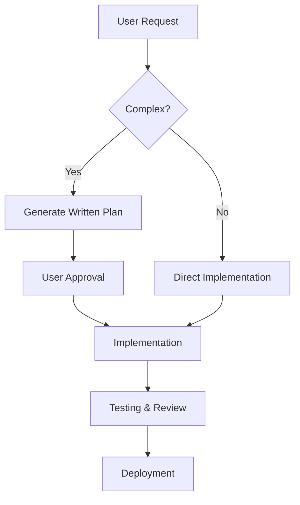

# CLAUDE.md - Development Guidelines & Best Practices

**IMPORTANT**: This file contains authoritative guidelines that govern all coding, reasoning, and project management behaviors. These rules are persistent and override conversational prompts unless explicitly stated otherwise.

## 🧠 Agent Optimization & Reasoning

### Extended Reasoning Protocol
- **Complex Tasks**: Always engage in deep, multi-step reasoning before implementation
- **Subagent Decomposition**: For intricate projects, automatically split into specialized roles:
  - **Planner**: Creates architecture and task breakdown
  - **Coder**: Implements based on specifications
  - **Reviewer**: Validates code quality and best practices
  - **Tester**: Ensures functionality and edge cases
- **Multi-shot Prompting**: Use consistent examples and structured formats for predictable outputs
- **Context Preservation**: Maintain key facts and project state across interactions

### Decision Making Framework
1. **Analyze Requirements**: Understand constraints, stakeholders, and success criteria
2. **Generate Options**: Consider multiple implementation approaches
3. **Evaluate Trade-offs**: Assess complexity, maintainability, performance, security
4. **Select Approach**: Choose optimal solution based on project needs
5. **Document Rationale**: Explain why specific approach was chosen

## 🏗️ Project Workflow

### Planning First Protocol


- **Mandatory Planning**: For all non-trivial tasks, create structured plan before coding
- **Plan Components**:
  - Overview and objectives
  - Technical approach and architecture
  - Implementation steps with dependencies
  - Testing strategy
  - Risk assessment and mitigation
  - Timeline and deliverables

### Test-Driven Development (TDD)
1. **Test Creation**: Write tests based on input/output specifications
2. **Test Execution**: Run tests to confirm they fail initially
3. **Commit Tests**: Separate commit for failing tests
4. **Implementation**: Write minimal code to make tests pass
5. **Code Refactoring**: Improve design while maintaining test coverage
6. **Commit Implementation**: Separate commit for working code
7. **Repeat**: Continue cycle for all features

### Iterative Refinement Process
- **Small Increments**: Break large features into manageable pieces
- **Continuous Integration**: Test and validate after each increment
- **Feedback Loop**: Incorporate testing results into next iteration
- **Quality Gates**: Ensure each increment meets quality standards

## 💻 Code Quality & Architecture

### SOLID Principles
- **S**ingle Responsibility: Each class/module has one reason to change
- **O**pen/Closed: Open for extension, closed for modification
- **L**iskov Substitution: Derived classes can replace base classes
- **I**nterface Segregation: Specific interfaces over general ones
- **D**ependency Inversion: Depend on abstractions, not concretions

### Code Standards
- **DRY Principle**: Eliminate duplicate code through abstraction
- **KISS Principle**: Keep implementations simple and readable
- **Modular Design**: Create loosely coupled, highly cohesive modules
- **Naming Conventions**: Use clear, descriptive names for variables, functions, and classes
- **Error Handling**: Implement comprehensive error handling with proper logging

### Code Organization
```
src/
├── components/          # Reusable UI components
│   ├── ui/              # Base UI components
│   ├── common/          # Shared components
│   └── features/        # Feature-specific components
├── pages/               # Route-level components
├── hooks/               # Custom React hooks
├── services/            # Business logic and API services
├── utils/               # Utility functions
├── types/               # TypeScript type definitions
├── constants/           # Application constants
└── styles/              # Styling and themes
```

### Code Quality Checklist
- [ ] Functions have single responsibilities
- [ ] No duplicate code patterns
- [ ] Proper error handling implemented
- [ ] Tests cover edge cases and happy paths
- [ ] Code is properly formatted and linted
- [ ] Documentation explains complex logic
- [ ] Dependencies are minimal and necessary

## 🐛 Debugging & Root Cause Analysis

### Structured Debugging Protocol
Use this table format for systematic debugging:

| Fact | Source | Hypothesis | Root Cause | Solution |
|------|--------|------------|------------|----------|
| What happened? | Where observed? | Why might it happen? | What's the actual cause? | How to fix it? |

### Debugging Process
1. **Fact Gathering**: Collect all relevant information about the issue
2. **Pattern Recognition**: Identify recurring behaviors or symptoms
3. **Hypothesis Formation**: Create testable explanations for the problem
4. **Root Cause Analysis**: Use debugging tools and logs to verify the cause
5. **Solution Implementation**: Apply the most effective fix
6. **Verification**: Test that the fix resolves the issue without side effects

### Common Debugging Tools
- **Browser DevTools**: Network, console, and performance tabs
- **React DevTools**: Component state and props inspection
- **Logging**: Structured logging at appropriate levels
- **Error Boundaries**: Catch and log React component errors
- **Performance Monitoring**: Identify bottlenecks and slow operations

## 📦 Git & Collaboration Workflow

### Commit Message Standards
```
type(scope): subject

body

footer
```

**Types**: `feat`, `fix`, `docs`, `style`, `refactor`, `test`, `chore`
**Scope**: Component, module, or feature affected
**Subject**: Brief description (50 chars or less)
**Body**: Detailed explanation of changes
**Footer**: Breaking changes, issues closed, etc.

### Branch Strategy
- `main`: Production-ready code
- `develop`: Integration branch for features
- `feature/*`: New feature development
- `fix/*`: Bug fixes and patches
- `hotfix/*`: Critical production fixes
- `release/*`: Release preparation

### Pull Request Template
```markdown
## Description
Brief description of changes and their purpose.

## Type of Change
- [ ] Bug fix
- [ ] New feature
- [ ] Breaking change
- [ ] Documentation update

## Testing
- [ ] Unit tests pass
- [ ] Integration tests pass
- [ ] Manual testing completed
- [ ] Performance impact assessed

## Checklist
- [ ] Code follows project style guidelines
- [ ] Self-review completed
- [ ] Documentation updated
- [ ] No merge conflicts
```

### Version Control Best Practices
- **Small Commits**: Keep changes focused and reviewable
- **Atomic Changes**: Each commit does one logical thing
- **Clear History**: Commit messages explain the "why" not just "what"
- **Branch Protection**: Use pull requests for code review
- **Automated Testing**: CI/CD validates code quality

## ⚡ Model Selection & Performance

### Model Selection Guidelines
- **Claude 3.5 Sonnet**: Default for most development tasks
  - Fast response times
  - Good at multi-file reasoning
  - Cost-effective for routine tasks
- **Claude Opus**: High-stakes, architecture-heavy work
  - Deep analytical capabilities
  - Complex problem solving
  - Critical decision making

### Performance Optimization
- **Context Management**: Prioritize relevant information
- **Token Efficiency**: Use concise prompts for large contexts
- **Parallel Processing**: Handle multiple tasks simultaneously when possible
- **Caching Strategy**: Reuse results from previous computations

### Cost-Benefit Analysis
- **Task Complexity**: Match model capabilities to task requirements
- **Time Sensitivity**: Use faster models for urgent tasks
- **Quality Requirements**: Use advanced models for critical functionality
- **Budget Constraints**: Balance quality against operational costs

## 🛠️ Tooling & Context Expansion

### Development Tools Usage
- **CLI Tools**: Leverage bash, npm, git, and other command-line tools
- **IDE Integration**: Use available VS Code extensions and features
- **Linting**: Enforce code quality through automated tools
- **Testing Frameworks**: Use appropriate testing tools for the stack
- **Build Tools**: Optimize build processes for development and production

### Context Loading Strategy
1. **Project Structure**: Understand overall architecture
2. **Configuration Files**: Load build, dependency, and environment configs
3. **Documentation**: Review README, API docs, and architectural decisions
4. **Code Patterns**: Identify common patterns and conventions
5. **Dependencies**: Understand third-party libraries and their usage

### Memory Management
- **State Preservation**: Maintain key project facts across sessions
- **Context Files**: Store important information for future reference
- **Documentation**: Keep decisions and rationale accessible
- **Progress Tracking**: Maintain development progress and status

## 📚 Documentation & Output Standards

### File Documentation Template
```typescript
/**
 * Brief description of the module/component
 *
 * @description Detailed explanation of functionality
 * @author [Author Name]
 * @created [Creation Date]
 * @updated [Last Update Date]
 *
 * @example
 * // Usage example
 * const result = functionName(params);
 *
 * @see {@link related-file-or-documentation}
 */
```

### Plan Documentation Requirements
- **Executive Summary**: High-level overview of objectives
- **Technical Approach**: Architecture and implementation strategy
- **Implementation Steps**: Detailed, actionable task list
- **Dependencies**: Required libraries, services, or configurations
- **Risk Assessment**: Potential challenges and mitigation strategies
- **Success Criteria**: Measurable outcomes and acceptance criteria

### Code Examples
- **Runnable Code**: Provide copy-paste-ready implementations
- **Error Handling**: Include proper error scenarios
- **Edge Cases**: Consider boundary conditions and unusual inputs
- **Testing**: Show how to test the implementation
- **Comments**: Explain non-obvious logic and business rules

## 🤝 Collaboration Etiquette

### Communication Standards
- **Professional Tone**: Maintain respectful, constructive communication
- **Clarity**: Be specific and unambiguous in requests and responses
- **Timeliness**: Respond promptly to feedback and questions
- **Transparency**: Share progress, challenges, and decisions openly

### Feedback Process
1. **Acknowledge**: Confirm understanding of feedback
2. **Analyze**: Consider the technical and business implications
3. **Plan**: Determine how to incorporate feedback
4. **Implement**: Make the requested changes
5. **Verify**: Confirm that feedback has been addressed

### Decision Making
- **Clarification**: Ask questions when requirements are unclear
- **Options**: Present multiple approaches when appropriate
- **Trade-offs**: Explain the pros and cons of different solutions
- **Recommendations**: Provide clear rationale for preferred approach

## 📋 Persistence & Hierarchy

### Authority Structure
- **CLAUDE.md**: This document is the ultimate authority
- **Project Standards**: Override general best practices
- **Team Guidelines**: Supplement but don't contradict this document
- **Individual Preferences**: Subordinate to established standards

### Rule Persistence
- **Default Behavior**: Apply these rules unless explicitly instructed otherwise
- **Consistency**: Maintain standards across all interactions and projects
- **Continuous Improvement**: Update and refine guidelines based on experience
- **Documentation**: Keep this file current and comprehensive

### Compliance Verification
- **Regular Review**: Periodically assess compliance with these guidelines
- **Quality Checks**: Verify that code meets established standards
- **Process Audits**: Ensure workflows follow documented procedures
- **Feedback Integration**: Incorporate lessons learned into guidelines

---

## 🚀 Quick Reference

### Common Commands
```bash
# Development
npm run dev          # Start development server
npm run build        # Build for production
npm run test         # Run tests
npm run lint         # Check code style

# Git
git checkout -b feature/new-feature
git add .
git commit -m "feat: implement new feature"
git push origin feature/new-feature
```

### File Templates
- **Component**: Use provided React component template
- **Service**: Follow service class pattern with dependency injection
- **Hook**: Create custom hooks with proper TypeScript typing
- **Test**: Use testing template with arrange-act-assert pattern

### Quality Gates
- **Linting**: No linting errors allowed
- **Testing**: Minimum 80% code coverage
- **Documentation**: All public APIs documented
- **Performance**: No regressions in performance metrics

---

**Last Updated**: 2025-01-11
**Version**: 1.0.0
**Maintainer**: Development Team