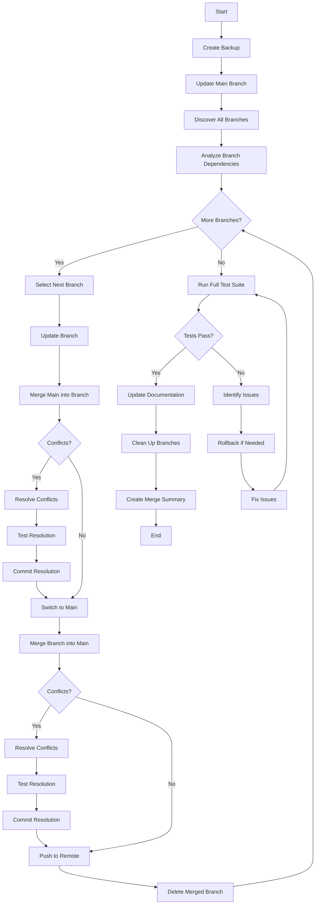
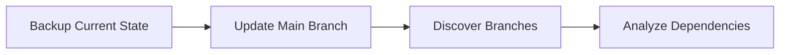
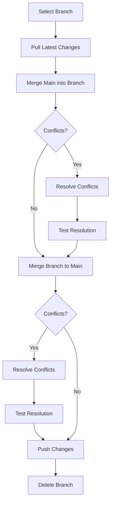
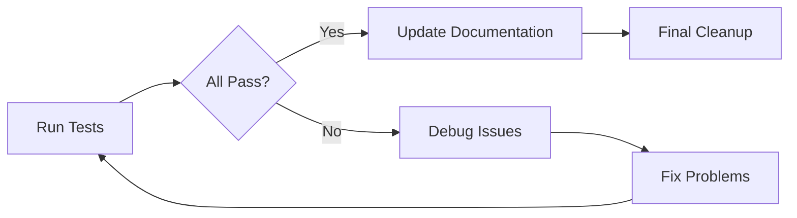
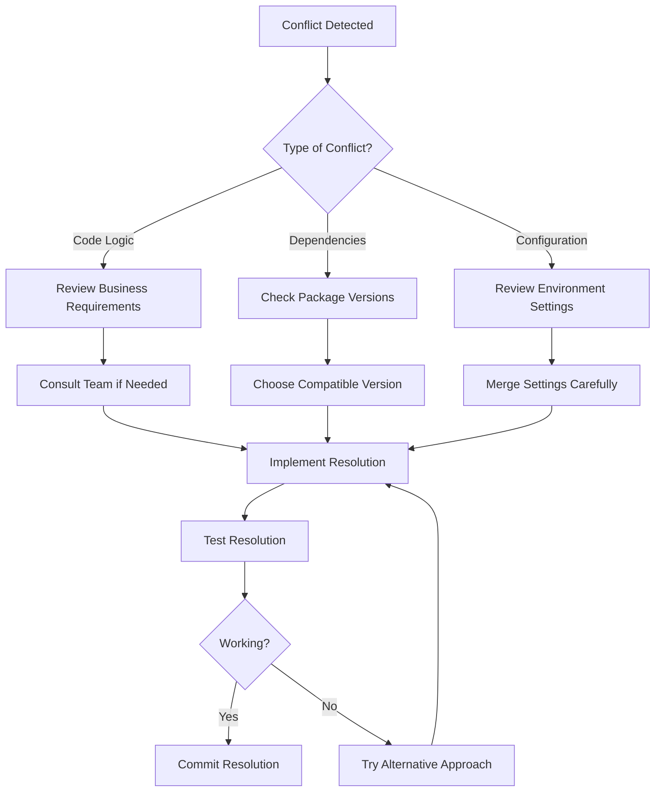
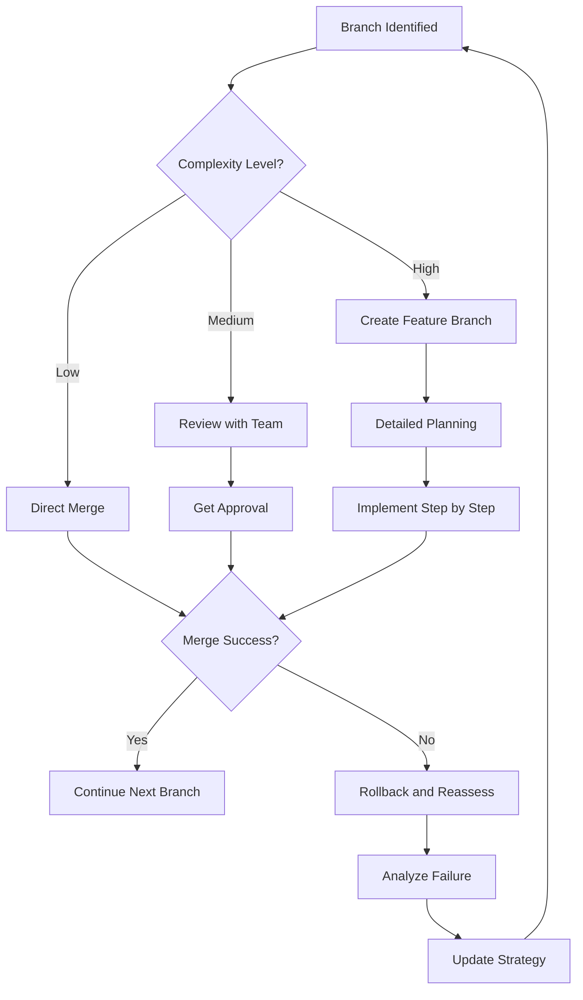
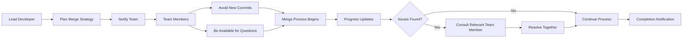
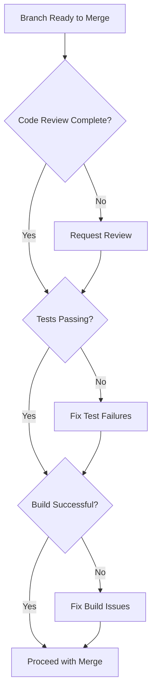
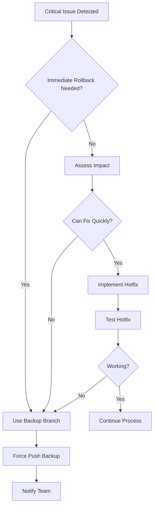
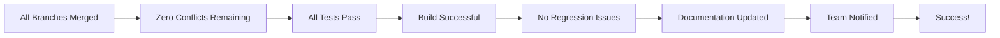

# Branch Merge Workflow Diagram

## Visual Overview



## Detailed Phase Breakdown

### Phase 1: Preparation


### Phase 2: Branch Processing


### Phase 3: Verification


## Decision Tree for Conflict Resolution



## Risk Assessment Flow



## Timeline Visualization

```
Day 1: Preparation (2-3 hours)
├── 0:00 - 0:30: Backup and setup
├── 0:30 - 1:00: Branch discovery
├── 1:00 - 2:00: Dependency analysis
└── 2:00 - 3:00: Strategy planning

Day 1-2: Merging (4-8 hours)
├── 3:00 - 7:00: Core infrastructure branches
├── 7:00 - 11:00: Feature branches
├── 11:00 - 15:00: UI component branches
└── 15:00 - 19:00: Integration and testing

Day 2: Finalization (2-3 hours)
├── 19:00 - 20:00: Full testing
├── 20:00 - 21:00: Documentation updates
└── 21:00 - 22:00: Cleanup and summary
```

## Team Coordination Flow



## Quality Gates



## Emergency Procedures



## Success Metrics



## Key Decision Points

1. **Backup Strategy**: Always create a backup before starting
2. **Branch Order**: Merge dependencies first, then features
3. **Conflict Resolution**: Test immediately after resolving conflicts
4. **Quality Gates**: Don't skip testing at any stage
5. **Communication**: Keep team informed throughout the process
6. **Rollback Planning**: Know how to undo changes if needed

## Best Practices Summary

- ✅ Create comprehensive backup
- ✅ Work in small, manageable batches
- ✅ Test after each merge
- ✅ Document all decisions
- ✅ Communicate with team
- ✅ Plan rollback procedures
- ✅ Review dependency relationships
- ✅ Validate each quality gate
- ✅ Keep detailed logs
- ✅ Monitor system performance